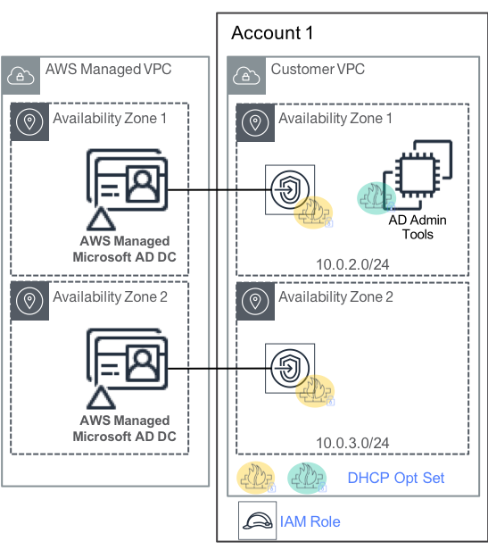

# Objective 
In this module we will create a AWS Managed Microsoft Active Directory, launch an EC2 Windows instance, join it to the managed AD domain and then install RSAT tools to manage users and groups in the Active Directory. This is desgined to work specifically in AWS GovCloud 

## Architecture

{:target="_blank"}


## Prerequisites

1. Ensure you are logged into an AWS account with admin access
2. Ensure you have VPC created with at least 2 subnets in different Availability Zones
3. AWS CLI set up on the local client.


## Create AD using the AWS CLI

1.  Download this [**file**](./files/createAd.json){:target="_blank"} or copy the contents below into a file and name it ``` createAd.json ```

    !!! tip " **Note**: make sure you modify the parameters in the file below as needed "


                {
                    "Name": "example.com", 
                    "ShortName": "example", 
                    "Password": "StrongPassword", 
                    "Description": "Sandbox Directory", 
                    "VpcSettings": {
                        "VpcId": "vpc-12345678", 
                        "SubnetIds": [
                            "subnet-12345678","subnet-12345678"
                        ]
                    }, 
                    "Edition": "Standard"
                }

2.  Run the AWS CLI command below to create the directory 

        aws ds create-microsoft-ad --cli-input-json file://createAd.json --region us-gov-west-1

    Sample Output

        {
            "DirectoryId": "d-1234567890"
        }

3.  Sign into the [AWS Management Console](https://console.amazonaws-us-gov.com/directoryservicev2/home?region=us-gov-west-1){:target="_blank"}.

## Create IAM role

!!! tip "this role will be used by the EC2 instance providing ec2 access to use Systems manager. SSM Run command is used to domain join the EC2 instance"

1. Download this [**file**](./files/assumeRole.json){:target="_blank"} or copy the contents below into a file and name it ``` assumeRole.json ```

        {
        "Version": "2012-10-17",
        "Statement": [
            {
            "Effect": "Allow",
            "Principal": {
                "Service": "ec2.amazonaws.com"
            },
            "Action": "sts:AssumeRole"
            }
        ]
        }

2. Run the AWS CLI commands below to create the IAM role, instance profile, and attach policy

        aws iam create-role --role-name TestEC2Role --assume-role-policy-document file://assumeRole.json  --region us-gov-west-1

        aws iam create-instance-profile --instance-profile-name TestEC2Role --region us-gov-west-1
        
        aws iam add-role-to-instance-profile --instance-profile-name TestEC2Role --role-name TestEC2Role --region us-gov-west-1

        aws iam attach-role-policy --policy-arn arn:aws-us-gov:iam::aws:policy/AmazonSSMFullAccess --role-name TestEC2Role --region us-gov-west-1

## Launch EC2 Instance

1. Run the AWS CLI command below to launch EC2 Windows 2016 base instance ( set the subnet as desired)

        aws ec2 run-instances --image-id ami-6bd2bd0a --count 1 --instance-type t2.large --subnet-id subnet-0e3f2b6c --security-group-ids sg-fb0d1099 --tag-specifications 'ResourceType=instance,Tags=[{Key=Name,Value=TestDomainMember}]' --region us-gov-west-1

## Domain Join using Systems manager

1. Create an SSM document that allows EC2 instance to join domain.

        aws ssm create-document --name "domainJoin" --document-type "Command" --content "{
        \"schemaVersion\": \"1.0\",
        \"description\": \"Automatic Domain Join Configuration created by EC2 Console.\",
        \"runtimeConfig\": {
            \"aws:domainJoin\": {
            \"properties\": {
                \"directoryId\": \"d-1234567890\",
                \"directoryName\": \"example.com\",
                \"dnsIpAddresses\": [
                \"AWS-DS-DNS-IP1\",
                \"AWS-DS-DNS-IP2\"
                ]
            }
            }
        }
        }" --region us-gov-west-1

2. Use Run command to execute the above document.

        aws ssm send-command --document-name "domainJoin" --instance-ids "instanceID" --parameters '{}' --timeout-seconds 600 --region us-gov-west-1

## Install RSAT tools

1. Install RSAT tools to manage users and Groups

        aws ssm send-command --document-name "AWS-RunPowerShellScript" --instance-ids "insertInstanceID" --parameters '{"commands":["Install-WindowsFeature -name RSAT-DNS-Server","Install-WindowsFeature -name RSAT-AD-Tools"],"executionTimeout":["3600"]}' --timeout-seconds 600 --region us-gov-west-1

