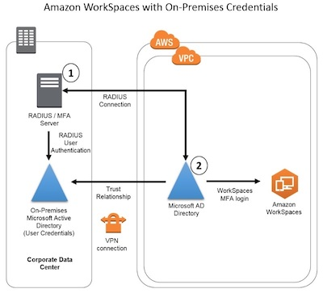
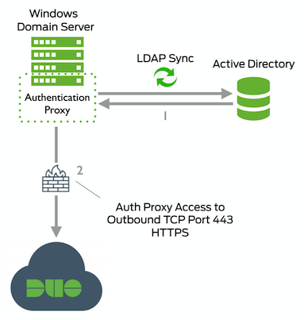
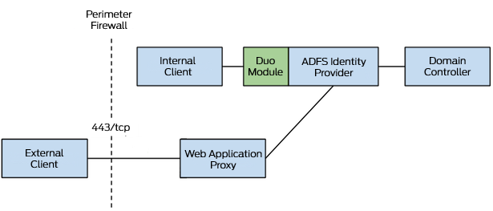
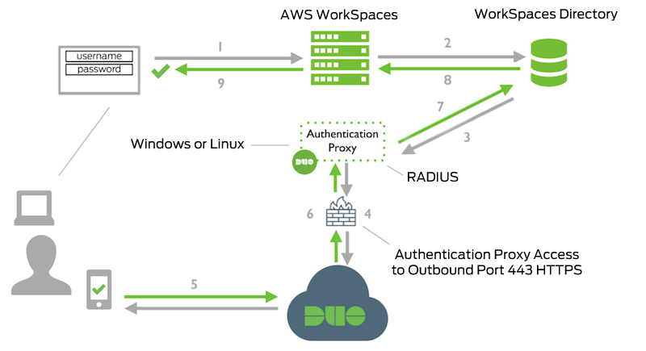

Enable Multi-Factor Authentication for AWS Managed Microsoft AD

To enable MFA, you must have an MFA solution that is a Remote Authentication Dial-In User Service (RADIUS) server, or you must have an MFA plugin to a RADIUS server already implemented in your on-premises infrastructure. Your MFA solution should implement One Time Passcodes (OTP) that users obtain from a hardware device or from software running on a device such as a cell phone.

You can enable multi-factor authentication (MFA) for your AWS Managed Microsoft AD directory to increase security when your users specify their AD credentials to access Supported Amazon Enterprise Applications. 

## Supported Amazon Enterprise Applications

All Amazon Enterprise IT applications including Amazon WorkSpaces, Amazon WorkDocs, Amazon WorkMail, Amazon QuickSight, and access to AWS Single Sign-On and AWS Management Console are supported when using AWS Managed Microsoft AD and AD Connector with MFA.

{:target="_blank"}

## Enable MFA using partner solution(Duo)

1. Set up AD Sync. Duo sync agents running on domain joined EC2 Instance.

    {:target="_blank"}

2. Enable MFA via AD FS while using Duo for MFA

    {:target="_blank"}

3. Enable MFA using Duo Radius proxy

    {:target="_blank"}
