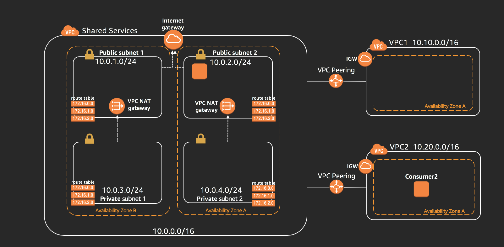

# Welcome to re:Invent 2018

### Introduction

This is a hands-on session where you are guided on how to create a shared services VPC. Shared services VPCs often contain resources like authentication, security services, logging, and more. We provide examples of how to share these services over both AWS PrivateLink and VPC peering. 

As part of this lab, there are 2 specific use cases we will be working on:

1. Deploying a AWS Directory services in a shared services VPC and use VPC peering to the shared services VPC to connect to the directory services.

2. Deploy a HTTP proxy server in a shared services VPC, and use AWS Private link feature to route HTTP requests to the Internet from consumer VPCs via the proxy server(s).

### Pre-requisites

1. AWS account with admin priveleges.

2. SSH keypair created in the AWS region where you will be running this lab. If you created one before but you dont have 
the private key, please go-ahead and create new keypair.

3. A laptop with ```SSH or RDP Client``` installed.

4. Finally, you all should have received AWS credits for this session. If not, please collect them from the speakers.


### Setting up the base environment

{:target="_blank"}

1. Login to the AWS management console.

2. **Click** on one of the link below to launch the cloudformation template. 

	[us-east-1](https://console.aws.amazon.com/cloudformation/home?region=us-east-1#/stacks/new?stackName=SharedServicesBaseTemplate&templateURL=https://s3-us-west-1.amazonaws.com/sharedservices-reinvent2018/basetemplate.json){:target="_blank"}

	[us-east-2](https://console.aws.amazon.com/cloudformation/home?region=us-east-2#/stacks/new?stackName=SharedServicesBaseTemplate&templateURL=https://s3-us-west-1.amazonaws.com/sharedservices-reinvent2018/basetemplate.json){:target="_blank"}

	[us-west-1](https://console.aws.amazon.com/cloudformation/home?region=us-west-1#/stacks/new?stackName=SharedServicesBaseTemplate&templateURL=https://s3-us-west-1.amazonaws.com/sharedservices-reinvent2018/basetemplate.json){:target="_blank"}

	[us-west-2](https://console.aws.amazon.com/cloudformation/home?region=us-west-2#/stacks/new?stackName=SharedServicesBaseTemplate&templateURL=https://s3-us-west-1.amazonaws.com/sharedservices-reinvent2018/basetemplate.json){:target="_blank"}

	_(Optional:- [Click here](./files/basetemplate.json) to download the template)_

3. Click **Next**.

4. Under the Parameters section **User Input Required** select **KeyName** from the down and select your test instance choice of **Linux or Windows** click Next.

5. Proceed by clicking **Next**.

6. Scroll down and check the box that reads **I acknowledge that AWS CloudFormation might create IAM resources with custom names.**.

7. Click **Create Stack**

8. Once the stack is created, under the **Outputs** you will find the IP address for the SquidProxy and Test Instances. You will need this information in the further sections.


### Create AWS Managed Microsoft AD directory

You will need:

1. Directory DNS and NetBIOS names

2. Admin password

3. VPC and Subnets: Shared Services VPC, Private Subnets 1&2.  

4. Start the creation process and move on to the next task.. [This will take about 30 minutes]

### URL Filtering - PrivateLink powered Squid proxy

_Configure the Squid instance in the Shared Services VPC_

1. Disable source/destination check on the **Squid Proxy** instance

2. Login to the instance and run commands below to install and run Squid:

```bash
	sudo yum install squid
	sudo systemctl enable squid.service
	sudo systemctl start squid.service
	sudo systemctl status squid.service
```

Note:- _You can check the default configuration of the Squid proxy from_ 

```bash 
sudo cat /etc/squid/squid.conf
```

### Configure Network Load Balancer (NLB) in the Shared Service VPC


1. Name: ServiceProviderLB
2. Schema: Internal
3. Load Balancer Protocol: TCP
4. Load Balancer Port: 3128
5. VPC: Select Service Provider VPC
6. Select both Availability Zones - Provider Public Subnet1 and Provider Public Subnet1
7. Tag: Name , Value => ServiceProviderLB
8. Target Group: New Target Group
9. Name: SquidProxyServerTG
10. Protocol: TCP
11. Port: 3128
12. Register Targets: Select the Squid EC2 instances.

### Create Endpoint Services:

1. Chose the NLB with the default acceptance requirements 
2. To grant permissions for principals to create interface endpoints from the same AWS account, add the ARN in the form ``` arn:aws:iam::<aws-account-id>:root ```
3. Copy Service name for next step

### Create Interface endpoint in the  Consumer 2 VPC

1. Navigate to **Endpoints** in the AWS VPC console.
2. Lookup service by using the name you copied above, verify to make sure principal has permissions.
3. Choose the available AZs, **ProxyTrafficSG** Security Group.
4. Switch to endpoint services view to accept the interface.
5. Copy the Private Link **DNS name**. Naviate to the *VPC Console-->Endpoints-->Select Endpoint-->Details Tab*

### Test URL access through proxy

_Linux Instance_

SSH into Test Linux Instance.

	$ export HTTP_PROXY="http://<DNS name of PrivateLink>:3128"
	$ export HTTPS_PROXY="http://<DNS name of PrivateLink>:3128"
	curl https://amazon.com

_Windows Test Instance_

1. Turn IE enhanced security off
2. Go to Internet options> connections> LAN setting> proxy server> Advanced 
3. add the interface endpoint DNS name to both http and https port 3128.
4. Test internet browsing 


_For troubleshooting, check:_

1. DNS endpoint should be resolved to private IP within the consumer VPC CIDR-subnet1
2. Telnet port 3128 should work from consumer machine 
3. Check if both Squid and consumer machines are on the same AZ-a

_Modify Squid Proxy config._

In this section you will modify the default squid config to whitelist few domains and verify that the config is in effect.

1. SSH into the Squid Instance.
2. Open the Squid configuration file.
```bash
sudo vi /etc/squid/squid.conf
```
3. Insert the statements below under the section __#INSERT YOUR OWN RULE(S) HERE TO ALLOW ACCESS FROM YOUR CLIENTs__ and save the file.
```
	acl whitelist dstdomain .amazon.com .google.com 
	http_access allow whitelist 
	http_access deny all
```
4. **Restart** the Squid service
```bash
	sudo systemctl restart squid.service
```

Now login to your test instance and go to a website that is not one of the domains listed above.


### Join a test instance to the domain

We will be creating a new Windows Instance in the Consumer1 VPC and choose to seamlessly join the AD directory created from above. Follow the steps below.

1. Go to the EC2 Console.
2. Click on **Launch Instance**
3. Select **Windows 2016 base AMI**
4. Select **t2.micro** instance type
5. Under the Instance details page, be sure to select **Service Consumer 1 VPC**, the Directory servie you created earlier for **Domain Join Directory** and for the **IAM Role** be sure to select **DomainJoinRole**.
6. With rest of the defaults proceed to the Security Group and select an existing group named **DomainMemberSG**.
7. Launch the Instance.
8. Once the Instance is available, you can RDP into using the Domain admin credentials you used while creating the Directory service.


