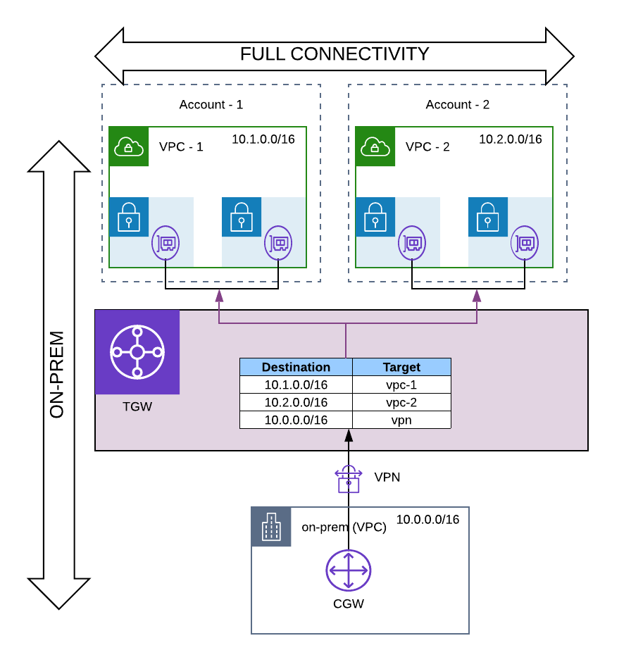
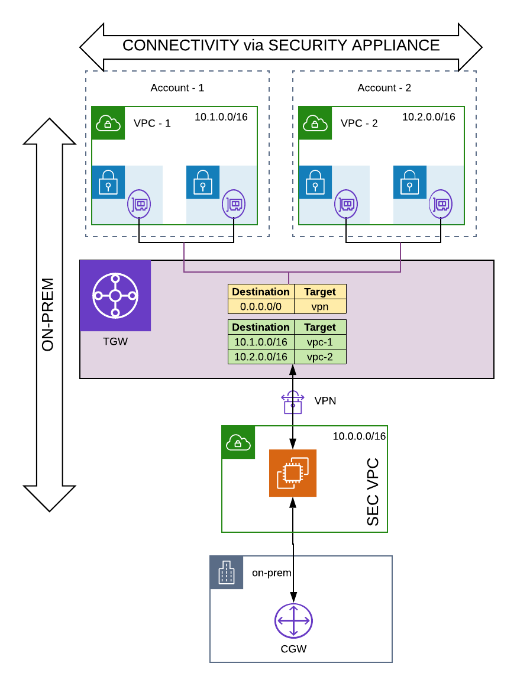
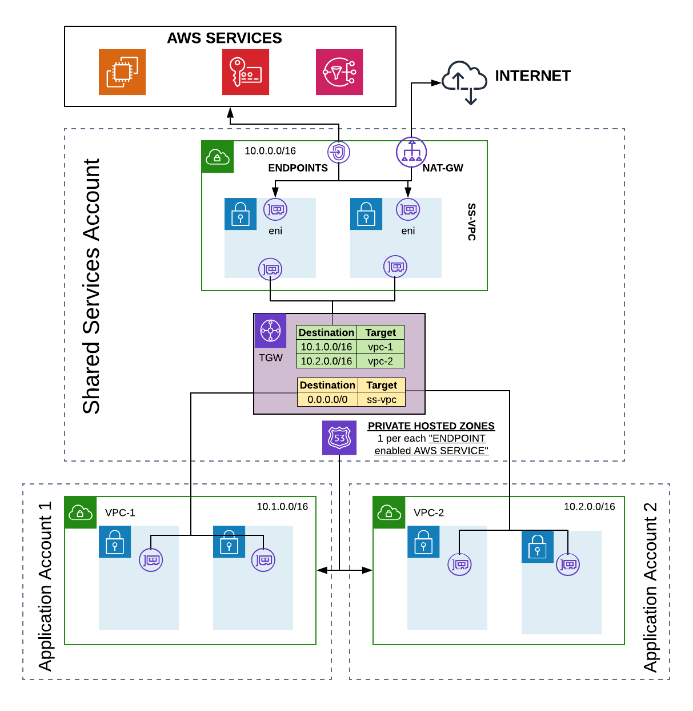

## AWS Transit Gateway architecture patterns.

1. Mulit Account Setup with VPN to On-Prem and flat routing.

    

2. **Edge routing With Security Appliance** : 
    
    Enforces all routing from VPCs to go through a security appliance.

    

3. **Shared services model** : 
    
    In this model a customer would be able to consolidate the egress endpoints like private endpoints for AWS Services and NAT gateway in a sharedservices VPC.

    

4. **Dual homed VPCs** . 
    
    A scenario where an end customer owns the TGW in their accounts and shares it with a partner(s) or an MSP for managing a suite of applications running in a separate AWS accounts. In this scenario, the partner or the MSP however would like to retain the control of communication between VPCs in the repsective accounts, and potentially from the partner premises to VPCs. To accomplish this, another TGW will be used in the partners/MSPs account, and this makes the VPCs dual homed.
